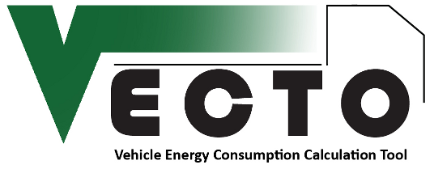

VECTOSimulator + Hashing tool
=============================
  * Copyright : 2014-2018 EUROPEAN COMMISSION
  * Developed : by TU-Graz & JRC, on behalf of DG CLIMA.
  * License   : EUPL 1.2

The Vecto-simulator + Hashing tool

## INSTALLATION:
This application is "portable" since no administration rights are needed, 
and you can simply copy and move it anywhere.

### Prerequisites:
The application is written in Windows VB.Net-4.0, so you have to ensure 
that it is installed properly.

To check whether .Net is installed on your PC and which version, 
follow this [article](http://support.microsoft.com/kb/318785/en-us).
If not, [install it](http://msdn.microsoft.com/en-us/library/vstudio/5a4x27ek%28v=vs.100%29.aspx)!

### License-file:
In order to run it, you should have received instruction on how to download 
and use your License file.  The installation procedure is similar to the one
described at [Vecto's wiki-page](https://webgate.ec.europa.eu/CITnet/confluence/display/VECTO/Installation+instructions).

In any case, you can contact JRC to ask for access to the above resources: 
    vecto@jrc.ec.europa.eu

## USAGE:
Read VECTO User Manual.
