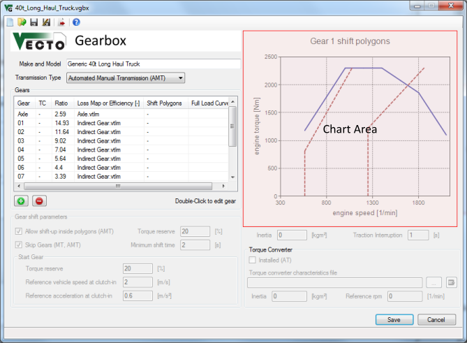

Gearbox Editor
==============

Description
-----------

The Gearbox File (.vgbx) defines alls gearbox-related input parameters like gear ratios and transmission loss maps. See [Gear Shift Model](../general/Shift.html) for details.

Relative File Paths
------------------

It is recommended to define relative filepaths. This way the Job File and all input files can be moved without having to update the paths. \
Example: "Gears\\Gear1.vtlm" points to the "Gears" subdirectory of the Gearbox File's directoy.

VECTO automatically uses relative paths if the input file (e.g. Shift Polygons File) is in the same directory as the Gearbox File. (The Gearbox File must be saved before browsing for input files.)

Main Gearbox Parameters
-----------------------

Make and Model
:   Free text defining the gearbox model, type, etc.

Transmission Type
:   Depending on the transmission type some options below are not available.The following types are available:
:   -   **Manual Transmission** (MT)
-   **Automated Manual Transmission** (AMT)
-   **Automatic Transmission** (AT)
-   **Custom**
:	Note: The types AT and Custom are not available in [Declaration Mode](../general/calc_Declaration.html).

Inertia \[kgm²\]
:   Rotational inertia of the gearbox (constant for all gears).

Traction Interruption \[s\]
:   Interruption during gear shift event.

Gears
-----

Use the  and  buttons to add or remove gears form the vehicle. Doubleclick entries to edit existing gears.

-   Gear "A" defines the ratio of the axle transmission / differential.
-   Column "TC" (AT only) defines which gears are using the torque converter (lock-up clutch open).
-   Column "Loss Map or Efficiency" allows to define either a constant efficiency value or a [loss map (.vtlm)](../fileformat/VTLM.html).
-   Column "Shift polygons" defines the [Shift Polygons InputFile (.vgbs)](../fileformat/VGBS.html) for each gear. Not requiredin [Declaration Mode](../general/calc_Declaration.html). See [GearShift Model](../general/Shift.html) for details.
-	Column "Full Load Curves" defines the [Full Load Curve for (.vfld)](../fileformat/VFLD.html) each gear. It is used for torque limiting and [generic shift polygons](../general/Shift.html) in Declaration Mode. If no file is defined the engine full load curve will be used. 

Gear shift parameters
---------------------

 Allow shift-up inside polygons
:   See [Gear Shift Model](../general/Shift.html).

 Skip Gears
:   See [Gear Shift Model](../general/Shift.html).

Torque Reserve \[%\]
:   This parameter is required for the **Allow shift-up inside polygons** and **Skip Gears** options.

Minimum shift time \[s\]
:   Limits the time between two gear shifts in whole seconds. This rule will be ignored if rpms are too high or too low. Note that high values may cause high rpms during acceleration.

Start Gear
:   In order to calculate an appropriate gear for vehicle start (first gear after vehicle standstill) a fictional load case is calculated using a specified **reference vehicle speed** and **reference acceleration** together with the actual road gradient, transmission losses and auxiliary power demand. This way the start gear is independent from the target speed. VECTO uses the highest possible gear which provides the defined **torque reserve**.

Chart Area
----------

The Chart Area displays the [Shift Polygons Input File(.vgbs)](../fileformat/VGBS.html) for the selected gear.

Torque Converter
----------------

The [Torque Converter Model](../general/TC.html) is still in development.

Inertia \[kgm²\]
:   Rotational inertia of the engine-side part of the torque converter.
(Gearbox-side inertia is not considered in VECTO.)

Controls
--------

 New file
:   Create a new empty .vgbx file

Open existing file
:   Open an existing .vgbx file

 ***Save current file***

 ***Save file as...***

 Send current file to the [VECTO Editor](VECTO-Editor.html)
:   **Note:** If the current file was opened via the [VECTO Editor](VECTO-Editor.html) the file will be sentautomatically when saved.

 ***Open file browser***

 ***Open file*** (see [File Open Command)](settings.html#opencmd).

 Save and close file
:   If necessary the file path in the [VECTO Editor](VECTO-Editor.html) will
be updated.

 ***Cancel without saving***
