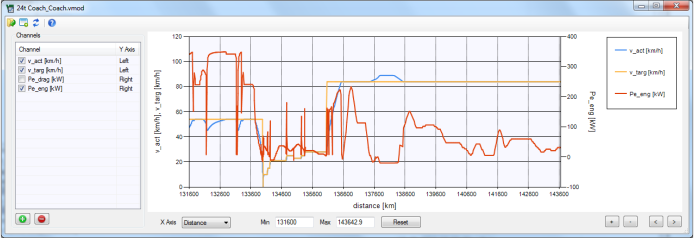

Graph Window
============

Description
-----------

The Graph Window allows to visualise [modal results files (.vmod)](../fileformat/VMOD.html). Multiple windows can be open at the same time to display different files.

Note that the graph does **not** update automatically if the results file has changed.

Channels
--------

Use the  and  buttons to add or remove channels. Doubleclick entries to edit existing channels.

Each channel can be plotted either on the left or on the right Y Axis. Use the checkbox to disable channels in the graph.

 X Axis Controls
----------------

The X Axis can either show distance or time.

Min, Max
:   Sets the range for the x axis.

Reset button
:   Reset the x axis range to display the complete cycle.

+, - buttons
:   Zoom in/out on the x axis.

&lt;, &gt; buttons
:   Move the x axis range left/right.

Controls
--------

 ***Open a .vmod file***

 ***Open a new Graph Window***

 ***Reload the currently open file***
