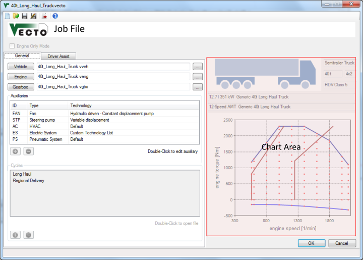

Job Editor
==========

Description
-----------

The job file (.vecto) includes all informations to run a VECTO calculation. It defines the vehicle and the driving cycle(s) to be used for calculation. In summary it defines:

-   Filepath to the [Vehicle File (.vveh)](#vehicle-editor) which defines the not-engine/gearbox-related vehicle parameters
-   Filepath to the [Engine File (.veng)](#engine-editor) which includes full load curve(s) and the fuel consumption map
-   Filepath ot the [Gearbox File (.vgbx)](#gearbox-editor) which defines gear ratios and transmission losses
-   Auxiliaries
-   Driver Assist parameters
-   Driving Cycles (not used in Batch Mode)

Relative File Paths
-------------------

It is recommended to define relative filepaths. This way the Job File and all input files can be moved without having to update the paths. Example: "Vehicles\\Vehicle1.vveh" points to the "Vehicles" subdirectory of the Job File's directoy.

VECTO automatically uses relative paths if the input file (e.g. Vehicle File) is in the same directory as the Job File. (The Job File must be saved before browsing for input files.)

 General Settings
-----------------

 Engine Only Mode

:	Enables [Engine Only Mode](#engine-only-mode). Only the following parameters are needed for this mode:

-   Filepath to the [Engine File (.veng)](#engine-editor)
-   [Driving Cycles](#driving-cycle-.vdri) including engine torque (or power) and engine speed

Filepath to the Vehicle File (.vveh)
:	Files can be created and edited using the [Vehicle Editor](#vehicle-editor).

Filepath to the Engine File (.veng)
:	Files can be created and edited using the [Engine Editor](#engine-editor).

Filepath ot the Gearbox File(.vgbx)
:	Files can be created and edited using the [Gearbox Editor](#gearbox-editor).

Auxiliaries
:	This list contains all auxiliaries used for calculation. The auxiliaries are configured using the [Auxiliary Dialog](#auxiliary-dialog). For each auxiliary an [Auxiliary Input File (.vaux)](#auxiliary-input-file-.vaux) must be provided and the [driving cycle](#driving-cycle-.vdri) must include the corresponding supply power.
**Double-click** entries to edit with the [Auxiliary Dialog](#auxiliary-dialog).

:  Add new Auxiliary
:  Remove the selected Auxiliary from the list

: See [Auxiliaries](#auxiliaries) for details.

Cycles
:	List of cycles used for calculation. The .vdri format is described [here](#driving-cycle-.vdri).
**Double-click** an entry to open the file (see [File Open Command](#settings)).
**Click** selected items to edit file paths.

:  Add cycle (.vdri)
:  Remove the selected cycle from the list

 Driver Assist Tab
------------------

In this tab the driver assistance functions are enabled and parameterised.

Engine Start/Stop
:	See [Engine Start/Stop](#engine-start-stop) for details.

Overspeed / Eco-Roll
:	See [Overspeed / Eco-Roll](#overspeed-eco-roll) for details.

Look-Ahead Coasting
:	See [Look-Ahead Coasting](#look-ahead-coasting) for details.

Acceleration Limiting
:	See [Acceleration Limiting](#acceleration-limiting) for details.

 Chart Area
-----------

If a valid [Vehicle File](#vehicle-editor), [Engine File](#engine-editor) and [Gearbox File](#gearbox-editor) is loaded into the Editor the main vehicle parameters like HDV class and axle configuration are shown here. The plot shows the full load curve(s) and shift polygons. In [Declaration Mode](#declaration-mode) the **generic**  shift polygons are shown, not the ones from the Gearbox File.

Controls
--------

 New Job File
:	Create a new empty .vecto file

 Open existing Job File
:	Open an existing .vecto file

 ***Save current Job File***

 ***Save Job File as...***

 Send current file to Job List in [Main Form](#main-form)
:	**Note:** The file will be sent to the Job List automatically when saved.

 ***Open [Vehicle Editor](#vehicle-editor)***

 ***Open [Engine Editor](#engine-editor)***

 ***Open [Gearbox Editor](#gearbox-editor)***

 ***Browse for vehicle/engine/gearbox files***

 Save and close file
:	File will be added to Job List in the [Main Form](#main-form).

 ***Cancel without saving***
