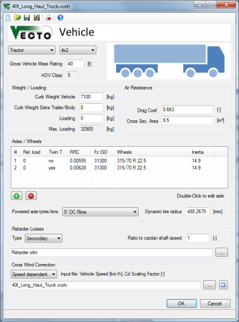

Vehicle Editor
==============

Description
-----------

The Vehicle File (.vveh) defines the main vehicle/chassis parameters like axles including [RRC](../general/RCC.html)s, air resistance and weight.

Relatve File Paths
------------------

It is recommended to define relative filepaths. This way the Job File and all input files can be moved without having to update the paths.
Example: "Demo\RT1.vrlm" points to the "Demo" subdirectory of the Vehicle File's directoy.

VECTO automatically uses relative paths if the input file (e.g. Retarder Losses File) is in the same directory as the Vehicle File. (The Vehicle File must be saved before browsing for input files.)

General vehicle parameters
--------------------------

Vehicle Category
: Needed for [Declaration Mode](../general/calc_Declaration.html) to identify the HDV Class.

Axle Configuration
: Needed for [Declaration Mode](../general/calc_Declaration.html) to identify the HDV Class.

Gross Vehicle Mass Rating [t]
: Needed for [Declaration Mode](../general/calc_Declaration.html) to identify the HDV Class.

HDV Class
: Displays the automatically selected HDV Class depending on the settings above.

Weight/Loading
--------------

These fields define the weight and loading of the vehicle. **Max. Loading** displayes the maximum possible loading for the selected vehicle depending on curb weight and GVW values.

***Note:*** *VECTO uses the sum of* ***Curb Weight Vehicle, Curb Weight Extra Trailer/Body*** *and* ***Loading*** *for calculation!*

Air Resistance
--------------

The product of **Drag Coefficient** [-], **Cross Sectional Area** [m²] and **Air Density** [kg/m³] (see [Settings](settings.html)) together with the vehicle speed defines the Air Resistance. Note that the Drag Coefficient may be altered when using [**Cross Wind Correction**](../general/cd.html).

Axles/Wheels
------------

For each axle the parameters **Relative axle load, RRC~ISO~** and **F~zISO~** have to be defined in order to calculate the total [Rolling Resistance Coefficient](../general/RRC.html). 
Furthermore the **Wheels Inertia [kgm²]** has to be set per wheel for each axle. In [Declaration Mode](../general/calc_Declaration.html) the inertia is defined automatically according to the selected tyres.
Use the  and  buttons to add or remove axles form the vehicle. Doubleclick entries to edit existing axle configurations.

Dynamic Tyre Radius [mm]
: Effective (dynamic) wheel radius used to calculate engine speed. In [Declaration Mode](../general/calc_Declaration.html) the radius calculated automatically using tyres/rims of the powered axle.

Powered axle tyres/rims
: Needed for [Declaration Mode](../general/calc_Declaration.html) to calculate the dynamic tyre radius.

Retarder Losses
---------------

If available a **Retarder Torque Loss Map** can be defined here to consider idling losses caused by the retarder.
***Note: Do not use this function if the retarder's losses are already included in the Transmission Loss Maps!***

Three options are available:
: -	None
-   Primary (before gearbox): The rpm ratio is relative to the engine speed
-   Secondary (after gearbox): The rpm ratio is relative to the cardan shaft speed

Both, primary and secondary retarders, require an [Retarder Loss Torque Input File (.vrlm)](../fileformat/VRLM.html).

Cross Wind Correction
---------------------

Three different options are available:
: -  No Correction
-  Speed dependent
-  Vair & Beta Input

Depending on the chosen mode either a [Speed Dependent Cross Wind Correction Input File (.vcdv)](../fileformat/VCDV.html) or a [Vair & Beta Cross Wind Correction Input File (.vcdb)](../fileformat/VCDV.html) must be defined. For details see [Cross Wind Correction](../general/cd.html).

Controls
--------

 New file
: Create a new empty .vveh file

 Open existing file
: Open an existing .vveh file

 ***Save current file***

 ***Save file as...***

 Send current file to the [VECTO Editor](VECTO-Editor.html)
: **Note:** If the current file was opened via the [VECTO Editor](VECTO-Editor.html) the file will be sent automatically when saved.

 Save and close file
: If necessary the file path in the [VECTO Editor](VECTO-Editor.html) will be updated.

 ***Cancel without saving***