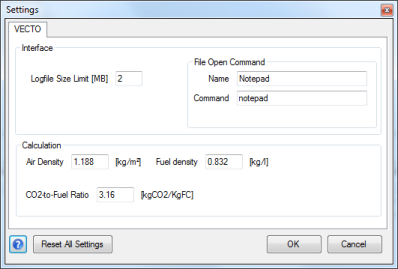

Settings
========

Description
-----------
In the Settings dialog controls general application settings. The settings are saved in the [settings.json](#application-files) file.

Interface Settings
------------------

Logfile Size Limit \[MB\]
:	Whenever the [Log File](#application-files) reaches this size it will be restarted. One backup is always stored as LOG\_backup.txt.

File Open Command
:	This command will be used to open CSV Input Files like Driving Cycles (.vdri). See: [Run command](http://en.wikipedia.org/wiki/Run_command)\
**Name**: Name of the command as it will be shown in the menu when clicking the  button.\
**Command**: The actual command.

:	***Example*** *: If the command is* ***excel*** *and the file is* ***C:\\VECTO\\cycle1.vdri*** *then VECTO will run:* ***excel "C:\\VECTO\\cycle1.vdri"***

Calculation Settings
--------------------

Air Density \[kg/m³\]
:	The Air Density is needed to calculate the air resistance together with the **Drag Coefficient** and the **Cross Sectional Area** (see [Vehicle Editor](#vehicle-editor)).

Fuel Density \[kg/l\]
:	The Fuel Density is used to calculate the l/km results.

CO~2~ -to-Fuel Ratio\[-\]
:	Mass ratio (kg~CO2~ / kg~FC~) used to calculate CO~2~ emissions.

Controls
--------

Reset All Settings
:	All values in the Settings dialog and Options Tab of the [Main Form](#main-form) will be restored to default values.

 ***Save and close dialog***

 ***Close without saving***
