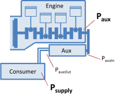

Auxiliaries
===========

In VECTO a generic map-based approach was implemented to consider all types of auxiliaries. The supply power demand for each single auxiliary is defined in the driving cycle. Hence a time/distance-dependent power demand can be defined. Based on the supply power and a pre-defined efficiency map the auxiliary input power is calculated. A constant efficiency determines the losses between auxiliary and engine.

For each auxiliary the power demand is calculated using the following steps:

1.  Auxiliary speed: **n~aux~ = n~Eng~ \* TransRatio**

2.  Auxiliary output power: **P~auxOut~ = P~supply~/EffToSply**

3.  Auxiliary input power: **P~auxIn~ = EffMap(n~Aux~, P~AuxOut~)**

4.  Auxiliary power consumption: **P~aux~ = P~auxIn~/EffToEng**

5.  **P~aux~ is added to the engine's power demand**

|            |                                                                                                       |                                 |  
| ---------- | ----------------------------------------------------------------------------------------------------- | --------------------------------|  
| n~Eng~     | Calculated engine speed.                                                                            | \[1/min\]                       |  
| TransRatio | Speed ratio between auxiliary and engine. [Defined in the Auxiliary File](../fileformat/VAUX.html). | \[-\]                           |  
| n~aux~     | Auxiliary speed                                                                                     | \[1/min\]                       |  
| P~supply~  | Effective supply power demand. [Defined in the driving cycle](../fileformat/VDRI.html).             | \[kW\]                          |  
| EffToSply  | Consumer efficiency. [Defined in the Auxiliary File](../fileformat/VAUX.html).                      | \[-\]                           |  
| P~auxOut~  | Auxiliary output power                                                                              | \[kW\]                          |  
| EffMap     | Auxiliary efficiency map. [Defined in the Auxiliary File](../fileformat/VAUX.html).                 | \[kW\] = f( \[1/min\], \[kW\] ) |  
| P~auxIn~   | Auxiliary input power                                                                               | \[kW\]                          |  
| EffToEng   | Efficiency of auxiliary (belt/gear) drive. [Defined in the Auxiliary File](../fileformat/VAUX.html).| \[-\]                           |  
| P~aux~     | Mechanical auxiliary power demand at the crank shaft                                                | \[kW\]                          |  

Each auxiliary must be defined in the [Job File](../GUI/VECTO-Editor.html) and each [driving cycle](../fileformat/VDRI.html) used with this vehicle must include supply power for each auxiliary. To link the supply power in the driving cycle to the correct auxiliary in the Job File an ID is used. The corresponding supply power is then named *"&lt;Aux\_ID&gt;"*.

***Example:*** *The Auxiliary with the ID "ALT" (in the Job File) is linked to the supply power in the column "&lt;AUX\_ALT&gt;" in the driving cylce.*