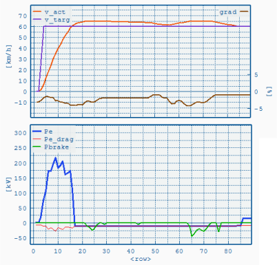

Overspeed / Eco-Roll
====================

Both functions control the vehicle's behaviour on uneven road sections (slope ≠ 0) and can be configured in the [Job File](../GUI/VECTO-Editor.html)'s Driver Assist Tab. Overspeed is designed to model an average driver's behaviour without the aid of driver assistance systems. Eco-Roll  represents an optional driver assistance feature. For this reason vehicles without Eco-Roll should always have the Overspeed function enabled.

Overspeed
---------

Overspeed activates as soon as the total power demand at the wheels (Pwheel) falls below zero, i.e. the vehicle accelerates on a negative slope. The clutch remains closed, engine in motoring operation, and the vehicle accelerates beyond the cycle's target speed. When the speed limit (target speed plus **Max. Overspeed**) is reached the mechanical brakes are engaged to prevent further acceleration.

*Example with target (purple) and actual speed (orange) on the top left axis, slope (brown) on the top right axis. The bottom graph shows engine power (blue), motoring curve (orange) and mechanical brake power (green). In this example Overspeed is allowed until the vehicle's speed exceeds target speed by 5 \[km/h\].*

Parameters in [Job File](../GUI/VECTO-Editor.html):
:	-   **Minimum speed \[km/h\]**. Below this speed the function is disabled.
-   **Max. Overspeed \[km/h\]** (relative to target speed)

Eco-Roll
--------

Instead of using the engine brake (with no fuel consumption) Eco-Roll shifts to Neutral, engine idling, to minimize deceleration and maximize the vehicle's roll out distance. During this phase the engine has to overcome its own idling losses and the power demand from the auxiliaries. The engine is engaged again if the speed exceeds the speed limits defined by Max. Over-/Underspeed.

 

*Example of Eco-Roll. Target (purple) and actual speed (orange) on the top left axis, slope (brown) on the top right axis. The bottom graph shows engine power (blue), motoring curve (orange) and mechanical brake power (green). The engine is idling while the vehicle rolls freely and braking when the upper speed limit is reached.*

Parameters in [Job File](../GUI/VECTO-Editor.html):
: -   **Minimum speed \[km/h\]** Below this speed the function is disabled.
-   **Max. Overspeed \[km/h\]** (relative to target speed)
-   **Max. Underspeed \[km/h\]** (relative to target speed)