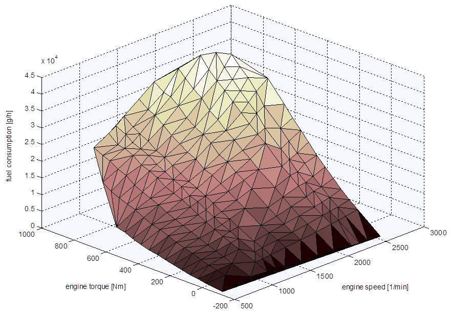

Fuel Consumption Calculation
============================

The base FC value is interpolated from the stationary [FC map](#fuel-consumption-map-.vmap). If necessary the base value is corrected to compensate for unconsidered auxiliary energy consumption for vehicles with Start/Stop. In Declaration Mode additionally the WHTC correction is applied, see below.

The CO~2~ result for the actual mission profile is directly derived from the fuel consumption using a gravimetric [CO~2~/FC factor](#settings).

Fuel Map Interpolation
----------------------

The interpolation is based on [Delaunay Triangulation ](http://en.wikipedia.org/wiki/Delaunay_triangulation) and works as follows:

1.  Triangulate the given rpm/torque/fuel points (= x,y,z)  to create a
    network of triangles with each point of the map being part of at
    least one triangle.
2.  Find the triangle where the to-be-interpolated load point (x,y)
    is inside. If no triangle meets the criterion the calculation will
    be aborted.
3.  Calculate the z-value (= fuel) of the given x,y-point in the plane
    of the triangle

*Delaunay Triangulation Example*

Auxiliary - Start/Stop Correction
---------------------------------

For vehicles with [Start/Stop](#engine-start-stop) the fuel consumption needs to be corrected to consider the wrong auxiliary energy balance caused by engine stops because VECTO uses a constant power demand for auxiliaries for the whole mission profile. The correction consists of the following steps:

1.  From all 1Hz data points of the VECTO simulation, a linear regression curve (y=k\*x+d) for fuel consumption (unit: grams per hour) over engine power (unit: kilo-watt) is calculated (see figure below).
2.  From the difference between the energy consumed by the auxiliaries in the simulation with Start/Stop function and the target value (unit kilowatt-hours), a cycle average change in mechanical power “ΔPe” (unit kilowatt) of the internal combustion engine is calculated (using an average alternator efficiency and the cycle time with running engine).
3.  The correction of the fuel consumption is performed for all 1Hz time steps using: ΔFC (unit: grams per hour) = ΔPe \* k where k = gradient in the regression. If the engine is running in motoring conditions ΔFC is set to zero.

*Example of a linear regression between engine power and fuel consumption*

WHTC Correction
---------------

The WHTC correction aims to counter the disadvantages of using a stationary FC map. The following steps are applied in VECTO for the WHTC correction method:

1.  VECTO interpolates the fuel consumption for the WHTC load cycle from the engine fuel map based on the target speed and target torque as determined based on the engine full-load curve. The results are FC values for the Urban, Rural and Motorway part.
2.  The correction factor CF~WHTC~ is calculated using the equation below considering the current mission profile's weighting factors for each part.
3.  The factor is multiplied to the FC values for each time step and the total FC result.

$CF_{WHTC} = \sum_{i=1}^{3} f_i \cdot \frac{FC_{meas_i}}{FC_{calc_i}}[-]$

where:

|                   |                                                    |            |
| ----------------- | -------------------------------------------------- | ---------- |
| $CF_{WHTC}$          | WHTC Correction Factor                             | \[-\]      |
| $i$                | index for each part (Urban, Rural, Motorway)       | \[-\]      |
| $f_i$              | Weighting factor per part                          | \[-\]      |
| $FC_{meas_i}$       | WHTC measurement result per part (input parameter) | \[g/kWh\]  |
| $FC_{calc_i}$       | Calculated FC per part                             | \[g/kWh\]  |
