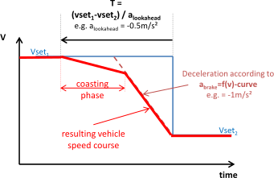

Look-Ahead Coasting
===================

Like Overspeed, Look-Ahead Coasting is a function that aims on modelling real-life driver behaviour. It is a forward-looking function that detects forthcoming reductions in target speed in the mission profile (e.g. change of road type / speed limit, etc.) and induces an early deceleration using engine braking before applying mechanical brakes according to the [deceleration limit](#acceleration-limiting).

 The implemented approach uses a predefined target deceleration (a~lookahead~) to calculate the deceleration time for each particular target speed change.

At the resulting deceleration start point the model calculates the
coasting trajectory until it meets the brake deceleration trajectory. The resulting deceleration consists of a coasting phase followed by combined mechanical/engine braking. If Look-Ahead Coasting is disabled only the braking phase according to the [deceleration limit](#acceleration-limiting) will be applied.

Parameters in [Job File](#job-editor):
: -   **Target Retardation** = a~lookahead~
-   **Minimum speed**. Below this speed the function is disabled.
