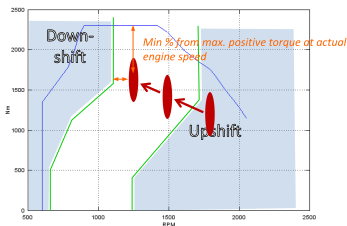

Gear Shift Model
================

The Gear Shift Model is based on shift curves that define the engine speed for up- and down- shifting as a function of engine torque. As soon as the engine operation point passes one of the shift curves a gear change is initiated. The shift polygons are saved in the [Shift Polygons Input File (.vgbs)](../fileformat/VGBS.html) and have to be added to the [Gearbox File](../GUI/GBX-Editor.html). \ 

In [Declaration Mode](calc_Declaration.html) the shift polygons are generated automatically based on the full load curve of each gear. If the engine's full load torque is lower than the gear's, then the engine's full load is used to prevent unreasonable shifting with small engines.

*Example shift polygons*

In the Gearbox File two additional parameters are defined:

-   **Torque Reserve** \[%\] - Required for the "**Early Upshift**" and "**Skip Gears**" options, see below.
-   **Minimum shift time** \[s\] - Limits the time between two gear shifts in whole seconds. This rule will be ignored if rpms are too high or too low. Note that high values may cause high rpms during acceleration.

Gear Skipping
-------------

Gear Skipping can be enabled in the [Gearbox File](../GUI/GBX-Editor.html). By default it is enabled for AMT and MT. Whenever a gear change is initiated (by crossing the up- or down-shift line) VECTO may skip one or several gears as long as the required torque reserve is provided.

Early Upshift
-------------
Early Upshift can be enabled in the [Gearbox File](../GUI/GBX-Editor.html) (Allow shift-up inside polygons). By default it is enabled for AMT only. If the next higher gear provides the required torque reserve and it's rpm is still above down-shift-rpm VECTO will shift up.

