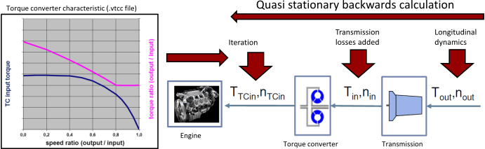
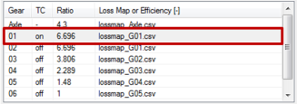
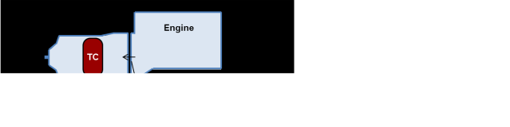

Torque Converter Model
======================

**!!! The Torque Converter Model is still in development !!!**

The torque converter is defined as (virtual) separate gear. While TC active: Iterative calculation of engine torque and speed based on TC characteristic. Creeping: Engine speed set to idling. Brakes engaged to absorb surplus torque.
 

Torque converter characteristics file (.vtcc)
---------------------------------------------

The file is described [here](../fileformat/VTCC.html).

Setup for Conventional AT gearboxes 
-----------------------------------

Torque converter file is defined for **torque converter only**

-   Define TC gear with ratio of first (mechanical) gear
-   Set transmission losses of first gear (map or constant efficiency)

Setup for Power-distributed AT gearboxes
----------------------------------------

Torque converter file is defined for the **whole gearbox**

-   Define TC gear with ratio = 1
-   Set transmission efficiency to 1 (= 100%) because losses are covered  by the .vtcc file.

