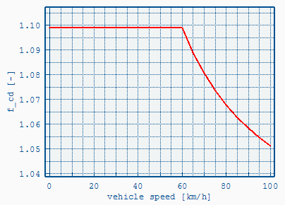
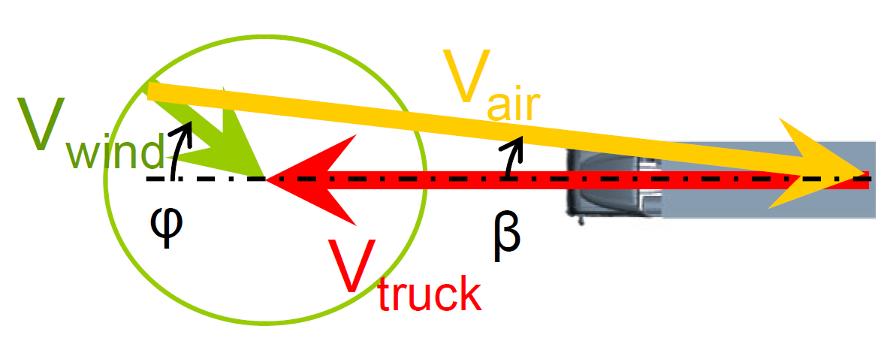

Cross Wind Correction
=====================

VECTO offers two different modes to consider cross wind influence on the drag coefficient. It is configured in the [Vehicle File](#vehicle-editor).

 Speed dependent correction (Declaration Mode)
----------------------------------------------

This is the default mode which is used in [Declaration Mode](#declaration-mode). The speed dependent c~d~ x A curve (see below) is calculated based on generic parameters for each vehicle class and the base c~d~ x A value form the [Vehicle File](#vehicle-editor).

Speed dependent correction (User-defined)
-----------------------------------------
The base c~d~ x A value (see [Vehicle File](#vehicle-editor)) is corrected with a user-defined speed dependent scaling function. The input file (.vcdv) format is described [here](#speed-dependent-cross-wind-correction-input-file-.vcdv).

 

 Correction using Vair & Beta Input
-----------------------------------

If available the actual (measured) air speed and direction can be used. The input file (.vcdb) defines the drag coefficient scaling factor. The
input file (.vcdb) format is described [here](#vair-beta-cross-wind-correction-input-file-.vcdb). The [driving cycle](#driving-cycle-.vdri) must include the air speed relative to vehicle (&lt;vair\_res&gt;) and the wind yaw angle (&lt;vair\_beta&gt;).

 
